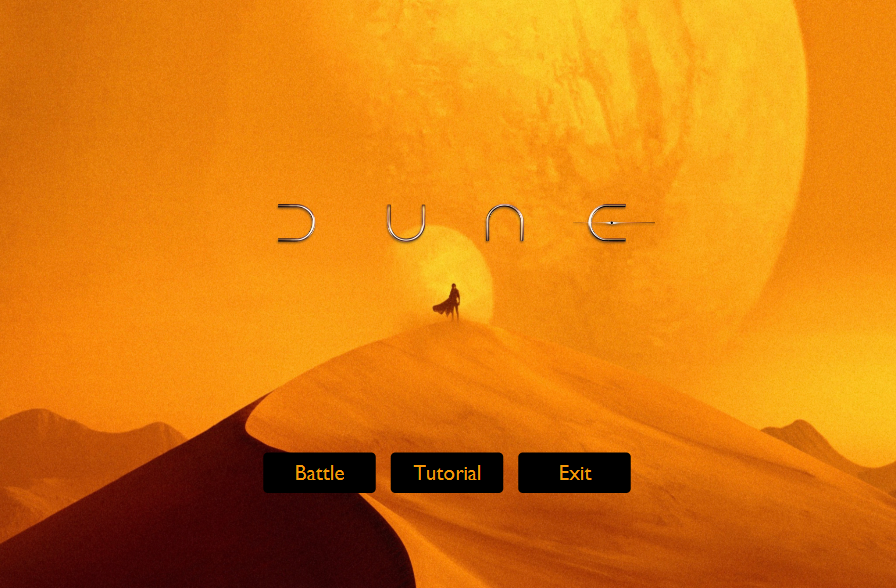
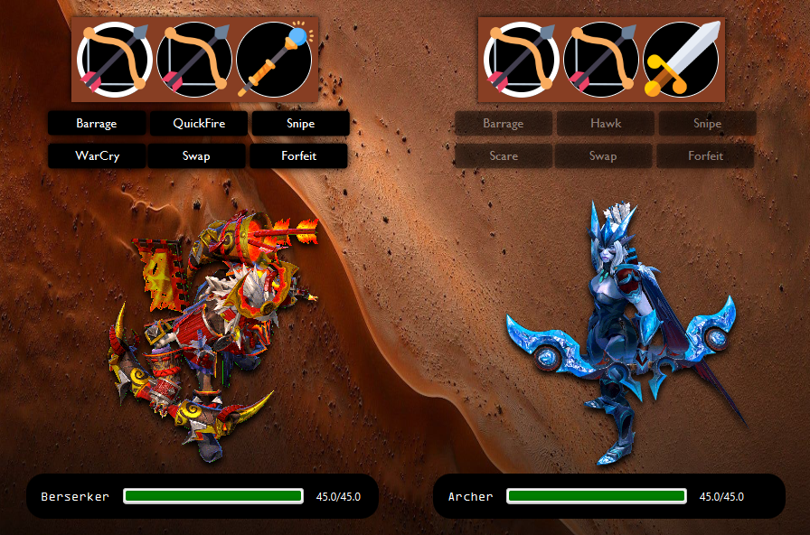
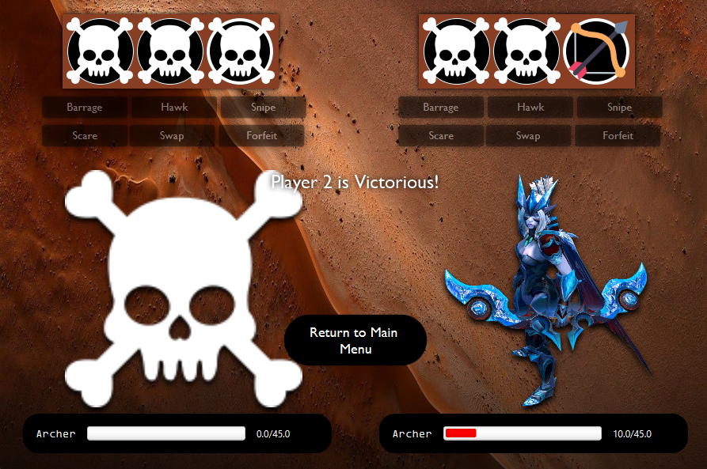

# Dune Turn-Based OOP Game :desert_island:	
Dune is a turn-based fighting game inspired by classics like early Final Fantasy, Chrono Trigger, and Pokémon. 
The theme draws from Frank Herbert's Dune, while the characters and artwork are a frankenstein of Dota 2, Cyberpunk 2077, and other sources.

This project served as a hands-on way to practice and showcase foundation Object-Oriented Programming concepts, using Scala as the language, 
and a Model-View-Controller (MVC) as the design pattern.

## Table of Contents :scroll:
- [Installation](#installation-hammer_and_wrench)
- [Usage](#usage-joystick)
- [FAQ](#faq)
- [Contributing](#contributing)

## Installation :hammer_and_wrench:
### Prerequisites
- SBT: Version 1.8.0+
- JDK: Version 11 ([highly recommended: Liberica Full JDK 11 LTS, which includes JavaFX 16](https://bell-sw.com/pages/downloads/#jdk-11-lts))
- JavaFX: Version 16

### Steps
1. **Clone the repository**:
    ```bash
    git clone https://github.com/amadzai/dune-game-oop
    ```

   *or, if using SSH:*
    ```bash
    git clone git@github.com:amadzai/dune-game-oop.git
    ```

2. **Navigate to the project directory**:
    ```bash
    cd dune-game-oop
    ```

3. **Build the project**:
    ```bash
    sbt compile
    ```

   *or, if using Maven:*
    ```bash
    mvn compile
    ```

4. **Run the project**:
    ```bash
    sbt run
    ```

   *or, if using Maven:*
    ```bash
    mvn exec:java
    ```

:warning: LOWER DOWN YOUR VOLUME! After running, a game window will pop up bringing you to the main menu, where the soundtrack will play.

## Usage :joystick:
1. After running, use the Main Menu to navigate to either the Battle, or the Tutorial to learn more about Dune.

<p style="text-align: center;">
  
</p>

2. Each player is randomly generated an army of 3 Heroes, each with their own Hero Type, as seen here in the Tutorial.

<p style="text-align: center;">
  
</p>

3. When in Battle, attack or debuff the opponent, buff your own Hero, or swap Heroes to have a higher Type Effectiveness.

<p style="text-align: center;">
  
</p>

4. Defeat all 3 of the opponent's Heroes to be victorious. Return to the Main Menu to begin a new battle.

<p style="text-align: center;">
  
</p>


