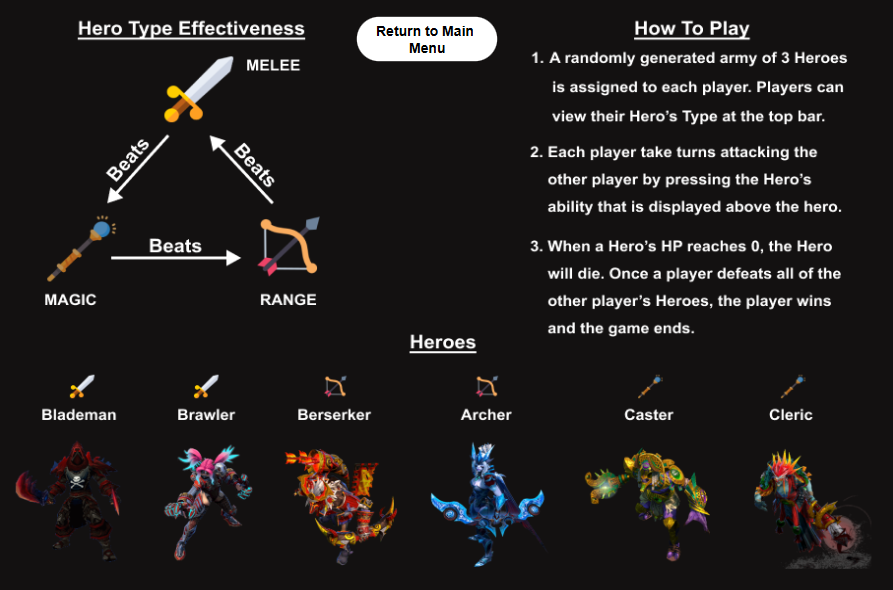

# Dune Turn-Based OOP Game :desert_island:	
Dune is a turn-based fighting game inspired by classics like early Final Fantasy, Chrono Trigger, and Pokémon. 
The theme draws from Frank Herbert's Dune, while the characters and artwork are a frankenstein of Dota 2, Cyberpunk 2077, and other sources.

This project served as a hands-on way to practice and showcase foundation Object-Oriented Programming concepts, using Scala as the language, 
and Model-View-Controller (MVC) as the design pattern.

## Table of Contents :scroll:
- [Installation](#installation-hammer_and_wrench)
- [Usage](#usage-joystick)
- [FAQ](#faq-question)

## Installation :hammer_and_wrench:
### Prerequisites
- SBT: Version 1.8.0+
- JDK: Version 11 ([highly recommended: Liberica Full JDK 11 LTS, which includes JavaFX 16](https://bell-sw.com/pages/downloads/#jdk-11-lts))
- JavaFX: Version 16

### Steps
1. **Clone the repository**:
    ```bash
    git clone git@github.com:amadzai/dune-game-oop.git
    ```

   *or, if using HTTPS:*
    ```bash
    https://github.com/amadzai/dune-game-oop.git
    ```

2. **Navigate to the project directory**:
    ```bash
    cd dune-game-oop
    ```

3. **Build the project**:
    ```bash
    sbt compile
    ```

   *or, if using Maven:*
    ```bash
    mvn compile
    ```

4. **Run the project**:
    ```bash
    sbt run
    ```

   *or, if using Maven:*
    ```bash
    mvn exec:java
    ```

:warning: LOWER DOWN YOUR VOLUME! After running, a game window will pop up bringing you to the main menu, where the soundtrack will play.

## Usage :joystick:
1. After running, use the Main Menu to navigate to either the Battle, or the Tutorial to learn more about Dune.


2. Each player is randomly generated an army of 3 Heroes, each with their own Hero Type, as seen here in the Tutorial.



3. When in Battle, attack or debuff the opponent, buff your own Hero, or swap Heroes to have a higher Type Effectiveness.


4. Defeat all 3 of the opponent's Heroes to be victorious. Return to the Main Menu to begin a new battle.


## FAQ :question:
1. When I sbt run, I encounter a missing library error, with an exception in thread "JavaFX Application Thread".
- This is an issue when downloading and installing an LTS release of JDK (11 in this case). These versions may not have the necessary JavaFX libraries installed. 
Either install from the recommended JDK link above, or manually add the missing libraries into your JDK bin folder. 
(Possible missing libraries: glib-lite.dll, gstreamer-lite.dll, jfxmedia.dll, fxplugins.dll)

2. Why can't I expand the game window into fullscreen?
- The current version of the project has not implemented dynamic window sizes as well as fullscreen, will be looking to add this in the future :).